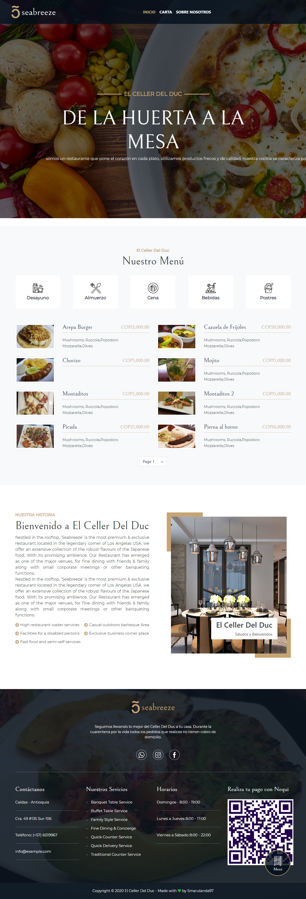

# EL CELLER DEL DUC

## PACKAGES
* Drupal
* Drupal Commerce
* Boostrap Sass

## IMPORTANT
- Download files.zip directory from my Google drive.
- Download database.sql.zip with project configuration from my Google drive.

## INSTALLATION PROCESS
* `composert install` Install dependencies and missing project scaffold files.
* `import database.sql` Extract previous dowloaded database.sql.zip and import in xampp, largon, wampp, etc.
* `cp web/sites/default/settings.example.php web/sites/default/settings.php` Create settings.php and write your database credentials into this file.
* `extract files.zip` Extract previous dowloaded files.zip into web/sites/default/.
* `vendor/bin/drus cr` Rebuild caches.
* `vendor/bin/drus updb` Apply database updates.
* `cd web/themes/custom/elcellerdelduc && gulp` Build css and js.

## LICENCE
MIT
